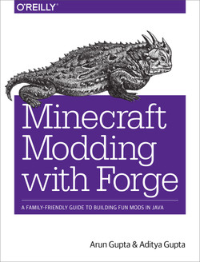
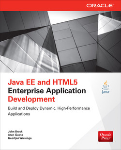
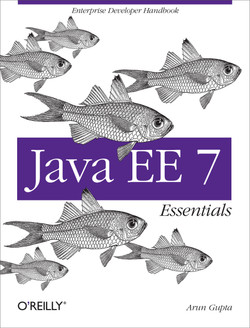
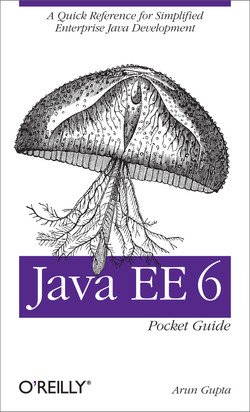

# Books by Arun Gupta

## Fostering Open Source Culture

  
Date: Released Nov 2024  
Publisher(s): Apress  
ISBN: 979-8868809767  

## Kubenetes for Java Developers

  
Date: Released Aug 2017  
Publisher(s): O'Reilly Media, Inc.  
ISBN: 9781491973288   

## Docker for Java Developers

  
Date: Released June 2016  
Publisher(s): O'Reilly Media, Inc.  
ISBN: 9781491957561  

## Minecraft Modding with Forge

  
Date: Released April 2015      
Publisher(s): O'Reilly Media, Inc.  
ISBN: 9781491918890  

## Java EE and HTML5 Enterprise Application Development

  
Date: Released March 2014  
Publisher(s): McGraw Hill Computing  
ISBN: 9780071823142  

## Java EE 7 Essentials

  
Date: Released August 2013    
Publisher(s): O'Reilly Media, Inc.  
ISBN: 9781449370602    

## Java EE 6 Pocket Guide

  
Date: Released September 2012  
Publisher(s): O'Reilly Media, Inc.  
ISBN: 9781449338343
